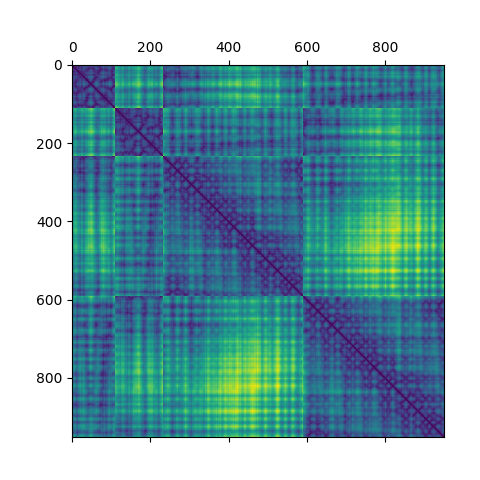

# protencoder 1.0
### Introduction
This is a Python utility to implement various encoding methods for protein structures including: pairwise mapping, vector encoding and one-hot encoding. 

**Note: ~~pypairwisemap~~ has been renamed to [protencoder](https://pypi.org/project/protencoder/) in 0.9**

#### Pairwise mapping

The method of encoding protein structures in terms of pairwise distances between alpha-carbons on the protein backbone was first implemented in the paper *Generative Modeling for Protein Structures*, which eliminates the need for generative models to learn translational and rotational symmetries.

To read more: [Generative Modeling for Protein Structures](https://papers.nips.cc/paper/7978-generative-modeling-for-protein-structures.pdf)

#### Vector encoding

This is a popular encoding scheme for deep learning frameworks, such as Deep Belief Networks and Deep Neural Nets. The returned vector represents a
window centered on the mutation site. Each position in the window except the mutation
site is represented by 20 binary numbers (0 or 1) that represent 20
possible amino acids at the position in the following order: 
```A, C, D, E, F, G, H, I, K, L, M, N, P, Q, R, S, T, V, W, Y```
The number representing the new residue is set to ```1``` and the rest are set to ```0```. The old residue replaced by the mutation is set to ```-1```. For example, if Alanine is mutated from Threonine then the vector would be 
```[1, 0, 0, 0, 0, 0, 0, 0, 0, 0, 0, 0, 0, 0, 0, 0, -1, 0, 0, 0]``` 

To read more about vector encoding: [Prediction of protein stability changes for single-site mutations using support vector machines](https://www.ncbi.nlm.nih.gov/pubmed/16372356), [A neural-network-based method for predicting
protein stability changes upon single point
mutations](https://watermark.silverchair.com/bth928.pdf?token=AQECAHi208BE49Ooan9kkhW_Ercy7Dm3ZL_9Cf3qfKAc485ysgAAAmgwggJkBgkqhkiG9w0BBwagggJVMIICUQIBADCCAkoGCSqGSIb3DQEHATAeBglghkgBZQMEAS4wEQQMD_HuqGbCWb8an74bAgEQgIICG4RycZxIovqgAsC-w5V9HYxTPm5k0np2IMEhQjGr8Z8fORdzkL_cP29_kfRb34u-tLqqe3dsNMZT9wdySBBTM-KPWxILofeB0uuAAaoRQiXVIecaYUZFwzVv2Xt4EXTVx5JPNLljbzz_r6V8Ex9m0K-9gWM0vze0KwDLEk_Wl3bKxUiL8oBDvpa9ymjvykHCcHNifLDxKcZvpqsAsaanU7if51dtdGoDtfhK5ODiC1Reub_D-jhMr06Y42EZoRdWMQ37I2lCjN1vCYoBIEwE24JuklmKT2qDp5PLkxpUsvVJ4G8JjJSTiGwkgaLZQE_OSrRS5dsItnGls14CWCVw2D8dhX5Cxe_FbpVIGZbjf1YcjpVj6PTKCEcutyWhycaa4Z4U7SJ-oAthT4_c7BqcckKKhU8JbuGOe4Wh6IKt1chNjz1ehf5tRBSrjmdFeiV5Bb6b53RYZ2anyxXHciGlCNnqFFx_-MR581JiSec3LRpl_BULppxU7_Pi5cyK4z70cpfdQESEvkoyaHIAn212fOhZsKTnCx6qkBxy7qsW0ybR51-mJWXCSQcu47kOrhTxUPkJHiAohOkf-wQGAVvfAW1pMd0pRl0pweKAqxocj6h2-fHTEYsErkJ87MOAaJLNWc30UE-DOSriGqX50o76QJGyVdKHFi-N90u595__fmGV3zgCX0R8Cf_94ExLiTLH97ta1R5h4c-vGh8_), [DNpro: A Deep Learning Network Approach to
Predicting Protein Stability Changes Induced by
Single-Site Mutations](https://pdfs.semanticscholar.org/69fa/0b70fc0ca2a6826f70a6fb306bec84d97201.pdf)

#### One-hot encoding

### Installation
```python
pip install protencoder==1.0
```

### Usage
```python
import protencoder as pe
#prints pairwise matrix
#arguments: pdb id, chain, fragment begin, fragment end, atom type
print(pe.get_pairwise_matrix('2ok6','A',1, 12,'CA'))
#saves pairwise matrix plot under './plots'
pe.get_pairwise_matrix_plot('2ok6','A',1, 12,'CA')
#gets mutation vector encoding with user specified window
#arguments: pdb id, chain, new residue, position, window
get_vector_encoding('2ok6','A','M',84,3)
```

### Sample plot   
#### Pairwise mapping with (n>900)


### Author
Chi Nok Enoch Kan/ [@chinokenochkan](https://github.com/chinokenochkan)